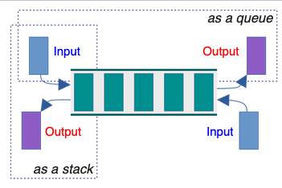

# Day 1 Speaker Notes

## 1.3.3 Do Algorithm Analysis

- What is time complexity?
  - Denoted by the Big-Oh, ex: O(n), O(n^2), O(nlogn) etc…
  - Time complexity measures how the number of operations grows with input size as n→∞.
- What is space complexity?
  - Space complexity measures how the memory required grows with input size as n→∞
  - Need this to not TLE or MLE (Time Limit Exceeded) (Memory Limit Exceeded)
- A computer can perform about 10^8 operations per second
- Show chart
- func1 is constant
- func2 is linear
- func3 is nlogn
  - Remember that built-in python sorting is O(nlog(n))
- func4 is quadratic

## Some Abstract Data Types

- Draw these on the board as we go through them
- Set
  - Data: a collection of unique elements
  - Ops: add, remove, contains, union, intersect
- List
  - Data: an ordered sequence of elements
  - Ops: insert, remove, get, size
- Map
  - Data: a collection of key-value pairs, where each key is unique and associated with a single value
  - Ops: put(key, value), get(key), remove(key)
- Graph
  - Data: non-linear structure of vertices and edges
  - Ops: add_vertex, add_edge, get_neighbors
- Queue
  - Data: linear collection operating on FIFO principle
  - Ops: enqueue, dequeue, front, is_empty
- Priority Queue
  - Data: linear collection where order is preserved according to element weight
  - Ops: insert, extract_min, extract_max, peek
- Stack
  - Data: linear collection operating on LIFO priciple
  - Ops: put(key, value), get(key), remove(key)
- Double-ended queue (Dequeue)
  - Data: Same as queue but you can enqueue and dequeue from both ends
  - Ops: enqueueLeft, enqueueRight, dequeueLeft, dequeueRight
  - 

## Binary Search Tree 

- Implements many ADTs
  - Ex: Binary heap, Sets
- For any given node: 
  - all values in its left subtree are smaller
  - All values in its right subtree are larger
- Balanced
  - If height of left and right subtree of every node differ by no more than 1
- Complete Binary Tree
  - All levels are fully filled except possibly the last, which is filled from left to right
- ASK CLASS For left, middle, then right, which ones are Balanced, Binary, Complete?
  - left is none, middle is balanced, right is balanced and complete
- ASK CLASS WHY?
  - Because every level halves the amount of search space, this is only true if we have a balanced tree

## Linked-List

- Implementation of the List ADT
- List is represented by the Head
- Each node points to the next node
- Too slow to practically use as a list implementation with certain rare exceptions
  - Ex. To access the end of the list, you would have to cycle through the whole list

## 2.3.1 Binary Heap (Priority Queue)

- Implementation of the Priority Queue ADT
- Data structure that satisfies 2 properties
  - Shape property: it is a complete binary tree (all levels are fully filled except possibly the last, which is filled from left to right).
  - Heap property: every parent node compares in a consistent way with its children
    - In a min-heap, each parent is less than or equal to its children → the smallest element is always at the root.
    - In a max-heap, each parent is greater than or equal to its children → the largest element is always at the root.
- Library:
  - heapq implements min heap
- Binary Heap is what heapq in Python uses and it is a specific implementation of a Heap
Why is this useful?
- Binary Heap (Priority Queues) Lets you always grab the largest/smallest item in O(logn) time instead of inserting and sorting which can be O(nlogn) time
- some useful methods:
- Read more about it in the python docs

|Function / Method|Runtime (Time Complexity)|
|---|---|
|`heapify(x)` | $O(n)$ |
| `heappush(heap, item)` | $O(\log n)$ |
| `heappop(heap)` | $O(\log n)$ |

## 2.3.2 Hash Table

- Implementation of the Map ADT
- Stores key-value pairs in an array by running each key through a hash function (turning it into an index), then places the value at that index
- If there is a collision, then it uses a linked-list (implementation of a list ADT) to store collisions at the same key
- Library: dictionaries and sets 
  - Runtime for methods are on average/amortized O(1) with a worst case of O(n)
  - ASK CLASS WHY?
    - because if your array is too small, then too many collisions, then your hash table is now an overcomplicated linked-list
- Why is this useful? (ASK CLASS)
  - Near instant lookup tool! Insertion, search/retrieval/update is super duper fast
  - Good for ex:
  - Frequency counting (how many times does a number/letter appear?).
  - Membership tests (has this state/word/number been seen before?).
  - Mapping (store extra info keyed by a string or ID).

## 2.4.1 Graph

- A graph G = (V, E) is a set of vertices (V) and edges (E)
- Edges store connectivity information between vertices in V
  - Can be in the form of weight and/or direction 
- Undirected/Directed Graph
  - A graph that is made up of a set of vertices connected by undirected/directed edges respectively
- Spanning Tree
  - The subgraph of a graph that contains the minimum amount of edges to connect all vertices
  - Used for Minimum Spanning Tree

## For rest on slides use slides as guiding notes

## 2.4.2 Union-Find Disjoint Sets (UFDS) - FindSet(i)

For UFDS, draw out example on slide 24
p = [1, 3, 3, 3, 3, 5, 6, 5, 5, 6, 4, 8,12] of size N = 13 ranging from p[0] to p[12].
DRAW path compression on the board

## 2.4.2 Union-Find Disjoint Sets (UFDS) - UnionSet(i, j)

Draw out why we want to link the shorter disjoint set to the representative item of the taller disjoint set
If you join the smaller to the taller then rank is preserved, not the other way around. DRAW it out

## Fenwick Tree (or Binary Indexed Tree)

- Explain what is a cumulative frequency table
- Explain what is a prefix sum
- 