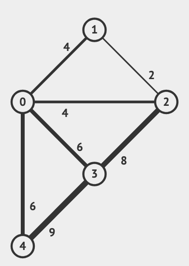
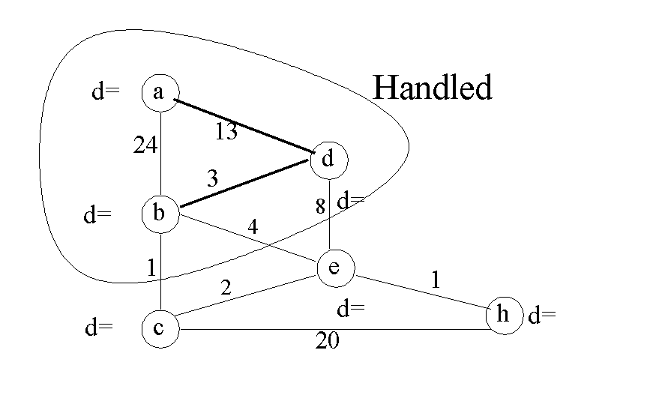

# Speaker Notes Day 4

## Minimum Spanning Tree (MST) - Kruskal’s Algorithm

- draw example on the board, so that you can see mst in action with unionfind
  - 

## Dijkstra's algorithm second example

- draw on board 
- and work through it